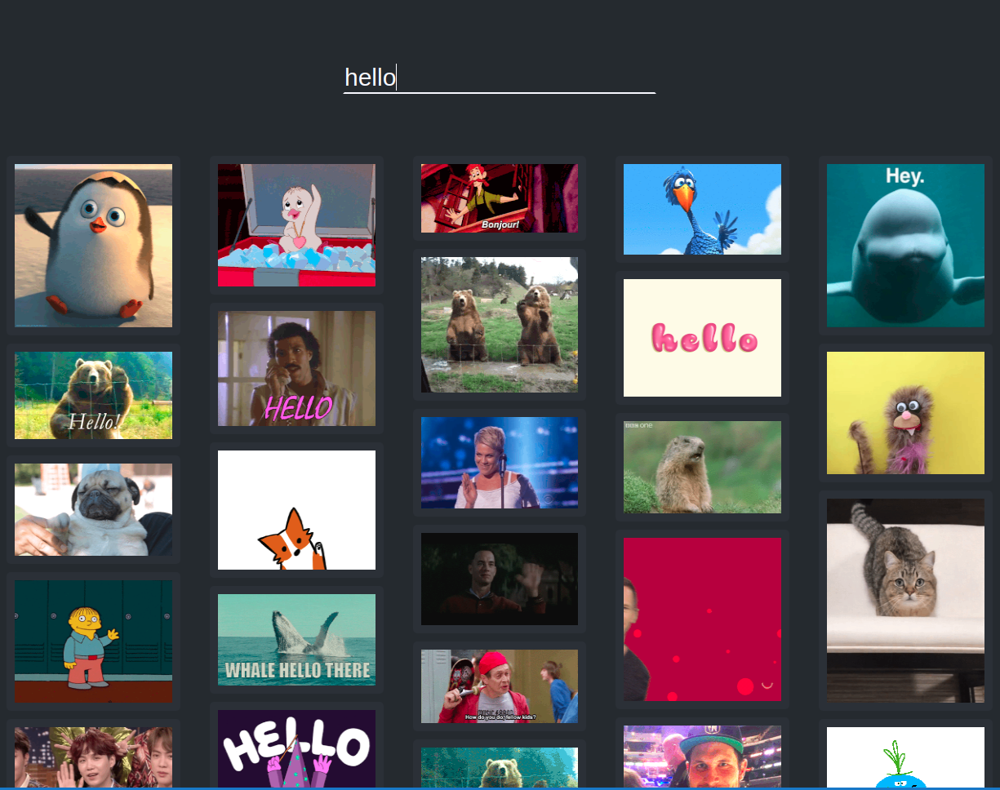

* Used Create React App as a starter kit
* Users can click on gif cards to view the title of the gif and send the gif to the slack incoming webhook.
* Focused on Searching efficiency by throttling and debouncing as the user types.
* Caching by all search inputs that triggered giphy api.
* Wrote a custom responsive masonry grid using multi-column functionality in css.
* Inifinite scroll functionality added.

